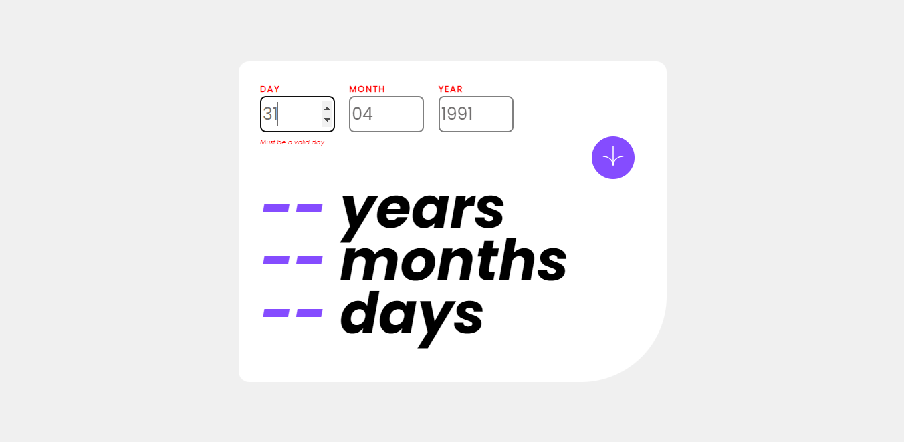

# Frontend Mentor - Age calculator app solution

This is a solution to the [Age calculator app challenge on Frontend Mentor](https://www.frontendmentor.io/challenges/age-calculator-app-dF9DFFpj-Q). Frontend Mentor challenges help you improve your coding skills by building realistic projects. 

## Table of contents

- [Overview](#overview)
  - [The challenge](#the-challenge)
  - [Screenshot](#screenshot)
  - [Links](#links)
- [My process](#my-process)
  - [Built with](#built-with)
  - [What I learned](#what-i-learned)
  - [Useful resources](#useful-resources)
- [Author](#author)

**Note: Delete this note and update the table of contents based on what sections you keep.**

## Overview

### The challenge

Users should be able to:

- View an age in years, months, and days after submitting a valid date through the form
- Receive validation errors if:
  - Any field is empty when the form is submitted
  - The day number is not between 1-31
  - The month number is not between 1-12
  - The year is in the future
  - The date is invalid e.g. 31/04/1991 (there are 30 days in April)
- View the optimal layout for the interface depending on their device's screen size
- See hover and focus states for all interactive elements on the page
- **Bonus**: See the age numbers animate to their final number when the form is submitted

### Screenshot



### Links

- Solution URL: [Age Calculator App Solution](https://github.com/cassiamoraes/Age-Calculator-App)
- Live Site URL: [Age Calculator Site](https://cassiamoraes.github.io/Age-Calculator-App/)

## My process

### Built with

- Semantic HTML5 markup
- CSS custom properties
- Flexbox
- CSS Grid
- SCSS
- JS
- TypeScript
- Mobile-first workflow
- [Styled Components](https://styled-components.com/) - For styles

### What I learned

To see how you can add code snippets, see below:

```html
<div class="form-list">
  <div class="form-group">
    <label for="day">Day</label>
    <input type="number" name="day" placeholder="DD" value="" id="day" min="1" max="31" required>
  <div class="divDay"></div>
</div>
```
```css
.form-group{
  width: 10rem;
  height: 5rem;
            
  .divDay, .divMonth, .divYear{
    margin-top: 0.5rem;
    letter-spacing: normal;
    text-transform: none;
    font-weight: normal;
    font-family: Century Gothic, sans-serif;
    font-style: italic;
    font-size: 10px;
    color: red;
  }
}
```
```ts
//model
export class Calculator{
    private _day: number;

    get day(): number {
        return this._day
    }
}

//controller
export class CalculatorController {
  private inputDay: HTMLInputElement

  constructor(){
    this.inputDay = document.querySelector('#day') as HTMLInputElement
  }

  print(): void{
    const calculator = this.calcDates()
  }
}
```

## Author

- LinkedIn - [Cassia Moraes](https://www.linkedin.com/in/cassia-moraes-797797139)
- Frontend Mentor - [@cassiality](https://www.frontendmentor.io/profile/cassiality)

